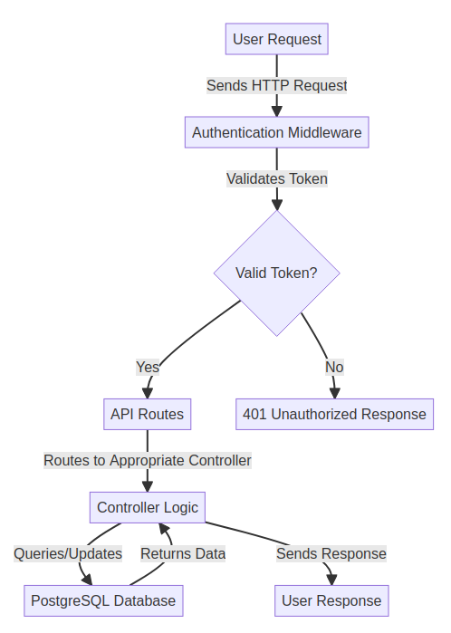

# IMF Gadget API

## Overview

The **IMF Gadget API** is a secure RESTful API for managing gadgets used by the Impossible Missions Force (IMF). This API allows users to register, authenticate, and perform CRUD operations on gadgets, while implementing robust authentication and authorization using JWT. The API is deployed on [Railway].

---
<p align="center">
  
</p>

## Table of Contents

1. [Authentication and Authorization](#authentication-and-authorization)
2. [Using the API](#using-the-api)
   - [Base URL](#base-url)
   - [Endpoints](#endpoints)
3. [Error Handling](#error-handling)
4. [Deployment](#deployment)

---

## Authentication and Authorization

### Register a New User

1. Send a `POST` request to `/api/auth/register` with the following body:
   ```json
   {
     "username": "your_username",
     "password": "your_password"
   }
   ```
2. Upon success, you'll receive a confirmation message:
   ```json
   {
     "message": "User created successfully"
   }
   ```

### Login (Generate JWT Token)

1. Send a `POST` request to `/api/auth/login` with your credentials:
   ```json
   {
     "username": "your_username",
     "password": "your_password"
   }
   ```
2. The response will include a JWT token:
   ```json
   {
     "token": "your_jwt_token"
   }
   ```

### Authenticate API Requests

To access protected routes, include the JWT token in the `Authorization` header as follows:

```text
Authorization: Bearer your_jwt_token
```

---

## Using the API

### Base URL

The API is deployed on **Railway**:\
``

### Endpoints

#### Authentication

- **Register a User**:\
  `POST /auth/register`\
  **Body**: `{ "username": "string", "password": "string" }`

- **Login**:\
  `POST /auth/login`\
  **Body**: `{ "username": "string", "password": "string" }`

#### Gadget Management (Protected)

- **Get All Gadgets**:\
  `GET /gadgets`\
  **Optional Query Parameter**: `?status=Available`\
  **Headers**: `{ "Authorization": "Bearer <token>" }`

- **Create a Gadget**:\
  `POST /gadgets`\
  **Body**: `{ "name": "string", "status": "string" }`\
  **Headers**: `{ "Authorization": "Bearer <token>" }`

- **Update a Gadget**:\
  `PATCH /gadgets/:id`\
  **Body**: `{ "name": "string", "status": "string" }`\
  **Headers**: `{ "Authorization": "Bearer <token>" }`

- **Soft Delete (Decommission) a Gadget**:\
  `DELETE /gadgets/:id`\
  **Headers**: `{ "Authorization": "Bearer <token>" }`

- **Trigger Self-Destruct**:\
  `POST /gadgets/:id/self-destruct`\
  **Body**: `{ "confirmationCode": "string" }`\
  **Headers**: `{ "Authorization": "Bearer <token>" }`

---

## Error Handling

The API uses consistent error responses to make debugging easier. Below are the common errors and their structures:

1. **Unauthorized Access** (No token provided or invalid token):

   - **Status Code**: `401`
   - **Response**:
     ```json
     {
       "error": "Unauthorized",
       "message": "Invalid or missing token"
     }
     ```

2. **Resource Not Found** (Invalid gadget ID or endpoint):

   - **Status Code**: `404`
   - **Response**:
     ```json
     {
       "error": "Not Found",
       "message": "Resource not found"
     }
     ```

3. **Validation Errors** (Missing or invalid fields in the request):

   - **Status Code**: `400`
   - **Response**:
     ```json
     {
       "error": "Bad Request",
       "message": "Validation error details"
     }
     ```

4. **Internal Server Error**:

   - **Status Code**: `500`
   - **Response**:
     ```json
     {
       "error": "Internal Server Error",
       "message": "An unexpected error occurred"
     }
     ```

---

## Deployment

This API is deployed on **Railway**. You can access it at:
``

To set up locally, follow these steps:

1. Clone the repository:

   ```bash
   git clone https://github.com/your-repo/imf-gadget-api.git
   cd imf-gadget-api
   ```

2. Install dependencies:

   ```bash
   npm install
   ```

3. Create a `.env` file in the root directory with the following contents:

   ```
   DATABASE_URL=your_postgresql_connection_url
   JWT_SECRET=your_jwt_secret
   ```

4. Run the application:

   ```bash
   npm run dev
   ```

5. Access the API locally at:

   - **Base URL**: `http://localhost:5000/api`

---


